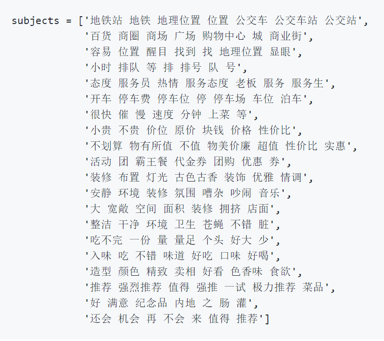
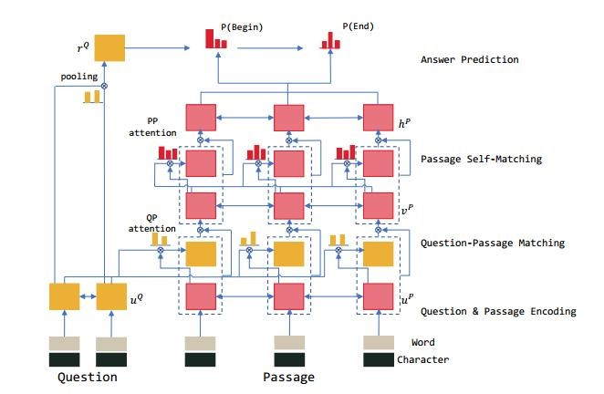
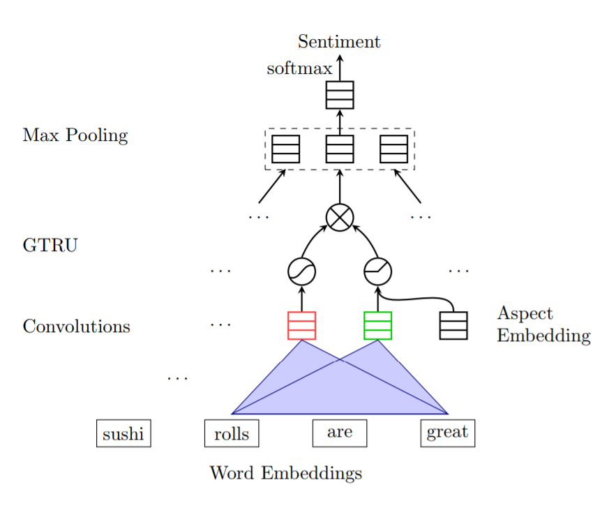
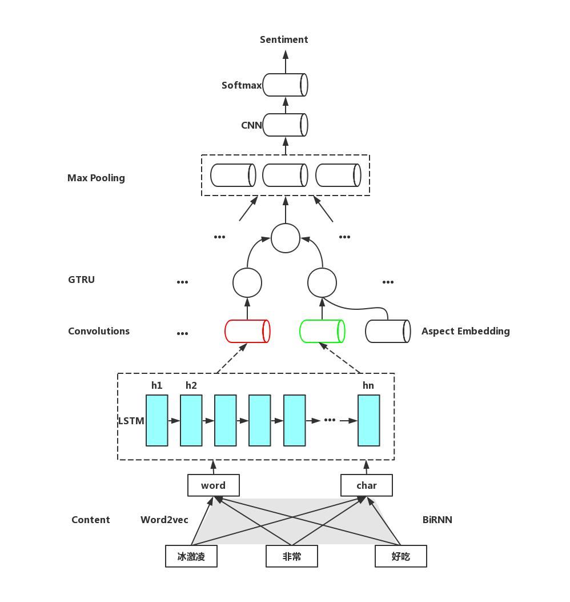

# Ai_challenge2018_nlp
# F1 = 0.71+
Ai_challenge2018_nlp细粒度情感分析——代码复现
# 1.	实验环境说明
Python版本：3.6.8
Cuda版本：9.0.176
Tensorflow版本：1.8.0
GPU版本：Titan V
Cudnn版本：7.5.0
# 2.	实验任务分析
该任务属于文本情感分析任务中的方面级情感分析(Aspect Based Sentiment Analysis, ABSA)下，与篇章级情感分析和句子级情感分析相比，它的粒度最细，其目的是分析出文本中涉及到的每一个方面上的情感倾向性（共20个方面）。
ABSA有两个子任务:
-（1）基于aspect类的情感分析(aspect-category sentiment analysis, ACSA)，主要任务是判断关于句子中的某个实体(entity)的情感极性。比如：
输入：文本是“这块手表的颜色不错”，entity是“颜色”
输出：情感极性
-（2）基于aspect词的情感分析(aspect-term sentiment analysis, ATSA)，主要任务是判断判断句子在某方面的情感极性，类似于一个多标签(multi-label)的任务。
输入：文本是“这家餐厅的环境还不错，可以菜做的不怎么样”
输出：环境方面的情感极性，交通便利方面的情感极性，做菜方面的情感极性。
该任务属于基于aspect词的情感分析(aspect-term sentiment analysis, ATSA)。
# 3.	实验方法设计
由于最后预测的结果包含二十个维度，因此先训练20个LightGBM模型，根据特征重要性进行排序并选取TOP7作为各维度的关键词，例如交通是否便利(traffic convenience)维度的“地铁站 地铁 地理位置 位置 公交车 公交车站 公交站”，距离商圈远近(distance from business district)维度的“百货 商圈 商场 广场 购物中心 城 商业街”。
 

## 3.1 文字编码部分
由《R-Net: Machine Reading Comprehension with Self-Matching Networks》[1]中，同时使用了char-embedding和word-embedding，不同的是char-embedding是通过将char放入双向GRU之后，最终的是通过GRU的最终状态来得到。利用两个双向RNN网络分别对question和passage再编码。而之前多数都是用的CNN卷积和highway。

 

于是在本次实验之中我们也借鉴这种word和char结合的方式，变相地增加了输入的数据量。并且使用w2v对word进行编码，对char使用BiRNN进行编码。
举个例子：奶茶十分好喝。词向量表示：[W2V(奶茶),W2V(十分), W2V(好喝)]
经过BiRNN的字向量：[BiRNN(奶,茶),BiRNN(十,分), BiRNN (好,喝)]
最终向量表示：[Concat(W2V(奶茶), BiRNN(奶,茶)), Concat(W2V(十分), BiRNN(十,分)), Concat(W2V(好喝), BiRNN(好,喝))]
在进行连接操作之后，再把该向量输入一个单向LSTM网络，捕捉上下文的信息。
至此，就完成了整个句子的编码。

## 3.2 主要模型
由《Aspect Based Sentiment Analysis with Gated Convolutional Networks》[2]，此文关注aspect类别或目标实体的情感极性。许多基于ABSA的模型已经被开发, 主要处理两个不同的子任务： aspect分类情绪
aspect分类情绪分析 (ACSA) 
aspect实体的情绪分析 (ATSA)
例如, 在句子 "Average to good Thai food, but terrible delivery ."中， ATSA 会分析实体Thai food的情感极性；ACSA 会分析aspect “service”情感极性, 即使“service”没有出现在句子中。
在aspect极性抽取任务之中，多数实验使用LSTM和attention机制来预测有关目标的情感极性，但模型往往很复杂并且需要很长的训练时间。本文提出了一个基于CNN和Gating Mechanisms（门机制）的模型。一种新的Tanh-ReLU 门单元能够根据给定的aspect或实体选择输出的情感特征。这个结构比应用于现有模型的attention层简单得多。同时，本文中模型的计算在训练中很容易并行化，因为卷积层不像LSTM层那样有时间依赖性，并且门单元也能够独立工作。此文在SemEval 数据集上进行试验，表明了实验效果的提升。
本文模型在更短的训练时间下能得到更好的精确度。对于ACSA任务，模型在embedding层之上有两个单独的卷积层，这个embedding层的输出是由新型门单元的组合组成的。多个滤波器的卷积层可以有效地提取每个接受域上多个粒度的n-gram特征。门单元有两个非线性门，两个中的每一个都和一个卷积层链接。在给定的aspect信息下，对于情感的预测能够抽取aspect-specific情感信息。比如说，在句子“Average to good Thai food, but terrible delivery”中当food这个aspect被提供，门单元能够自动忽视在第二个子句中delivery这个aspect的消极情绪，并且只输出第一个子句的积极情绪。因为模型中的每个组成部分都能够并行，因此比LSTM和attention机制需要更少的训练时间。对于ATSA任务，其中aspect由多个单词组成，本文扩展了模型以包含目标表达式的另一个卷积层。原文模型如下图：

 

在这个模型的基础上，在最后的线性层之前加上了CNN增加分类能力，最后在使用softmax分类。我们最终模型如下图：

# 4.	实验结果
表 1 模型及其预测结果
模型\参数	
n_hidden	learning_rate	dropout_keep	F1 score
- GCAE	400	0.0005	0.5	71%
- fastText	-	-	-	49%
- XGboost	-	-	-	45%
- Adaboost	-	-	-	44%
- SVM	-	-	-	41%
- BP	-	-	-	24%
- Naive Bayesian	-	-	-	23%
# 5.	讨论
在GCAE模型构建出来之前，还尝试过多种机器学习和深度学习的方法，结果如表1所示。其中fastText模型的训练速度较快，且结果也不逊于传统的机器学习模型，scikit-learn中的skift可以作为第三方工具被使用。最终，在验证集上得到一个f1均值约为0.49的fasttext多分类模型(20个），存储在fasttext_model.pkl中，其中涉及到learning_rate、word_ngrams、min_count等参数，最后的结果将learning_rate设置为0.5、word_ngrams 设置为2（相较于设置为1的效果更好）、min_count设置为1（设置为2有一些负向影响）。
Boost系列与BP和Naive Bayesian相比，最后得到的结果更好。猜测是测试集并不是随机抽样得来的，而是一些相对比较难的样本，这样测试集与验证集的先验分布不同，因此虽然BP和Naive Bayesian在验证集的分数很高（约为0.7），然而在测试集却表现很差；而boost算法中会给判错的样本更高的权重，相当于把先验分布改变得更均匀，因此表现更好。
“训练集是真实样本总体的无偏采样”这个假设往往并不成立，我们未必能有效地基于训练集观测几率来推测出真实几率。因此在后续实验中，可以采用如下方法尝试解决这个问题：
①直接对训练集里的“未提及”样例进行欠采样，即去除一些该样例使得四类样本数目相近，然后再进行学习，代表性算法为EasyEnsemble[3]，该算法是利用集成学习机制，将该样例划分为若干个集合供不同学习器使用，这样对每个学习器来看都进行了欠采样，但从全局来看却不会丢失重要信息。
②对训练集里“正面”、“中性”和“负面”样本进行“过采样”，即增加一些该样本使四类样本数目相近，但并不是简单地进行重复采样，这样会导致严重的过拟合。代表性算法为SMOTE[4]，通过对该样例进行插值来产生额外的样例。
此外，Attention对于文本的表达还是有很好的效果，之后可以Attention方式去更充分的提取文本特征，从而提升情感分析任务的精度。
# 6.	参考文献
- [1]	Wang, W., Yang, N., Wei, F., Chang, B., & Zhou, M. (2017). R-NET: Machine reading comprehension with self-matching networks. Natural Lang. Comput. Group, Microsoft Res. Asia, Beijing, China, Tech. Rep, 5.
- [2]	Xue, W., & Li, T. (2018). Aspect based sentiment analysis with gated convolutional networks. arXiv preprint arXiv:1805.07043.
- [3]	Liu, T. Y. (2009, August). Easyensemble and feature selection for imbalance data sets. In 2009 International Joint Conference on Bioinformatics, Systems Biology and Intelligent Computing (pp. 517-520). IEEE.
- [4]	Chawla, N. V., Bowyer, K. W., Hall, L. O., & Kegelmeyer, W. P. (2002). SMOTE: synthetic minority over-sampling technique. Journal of artificial intelligence research, 16, 321-357.
